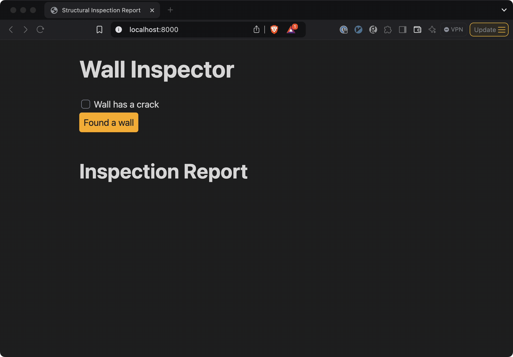

# Wall Inspector

This is a simple web app that allows you to inspect walls and report on their condition.
As you do so, a report will be generated, which can be pasted wherever you need it.



It was based heavily on this tutorial: https://testdriven.io/blog/fastapi-htmx/

To see how the report is generated, check out [templates/report.html](templates/report.html).

If you're not sure what you're looking at there, consider reading this: https://ttl255.com/jinja2-tutorial-part-1-introduction-and-variable-substitution/ (I just skimmed it, there might be better resources out there).

Another component doing the heavy lifting here is [fastapi](https://fastapi.tiangolo.com/tutorial/first-steps/), which handles the web requests.

Also featured is [htmx](https://htmx.org/), which runs in the browser and makes the page work.  I hardly know anything about it, but between the fastapi-htmx tutorial and some AI help, I managed to get it working.

### [uv](https://github.com/astral-sh/uv) commands

(I havent yet tested these on windows, I'm letting the AI drive here.  I'll try them out sometime soon.)

First, install UV if you don't have it:
```bash
# On macOS/Linux:
curl -LsSf https://astral.sh/uv/install.sh | sh

# On Windows:
powershell -c "irm https://astral.sh/uv/install.ps1 | iex"
```

Then, create and activate a virtual environment:
```bash
uv venv
source .venv/bin/activate  # On Windows: .venv\Scripts\activate
```

Install dependencies:
```bash
uv pip install -e ".[test]"
```

Run the tests:
```bash
uv run pytest -v -s tests/
```

Start the development server:
```bash
uv run uvicorn crackornot:app --reload
```

### Nix commands

nix is not yet supported on windows, try `uv` instead ☝️

Uses [uv2nix](https://github.com/pyproject-nix/uv2nix) to build the project.  Tested only on darwin, but probably works on linux.

```bash
nix develop
nix flake check
nix run .#serve
```

